# Tailoring DQN to Qbert

## Background

### Qbert-v4 Environment
<p align="center">
  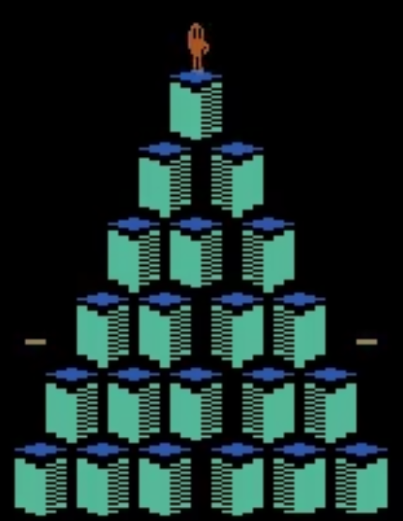
</p>

The Qbert-v4 environment implements the 1982 arcade platform game Q\*bert, developed by Gottlieb [[1](https://en.wikipedia.org/wiki/Q*bert)].
In the game, the player controls a character named Q\*bert on a pyramid consisting of 21 cubes.
The objective of the game is to change the color of all these cubes into the destination color by jumping on them,
while avoiding different enemies. There are 5 different enemies in the game. They are:
- Red Ball: This ball rolls down the pyramid. When coming in contact with this ball, Q\*bert will die. This enemy only appears in expert mode, which is not activated in the case of this report.
- Purple Ball: This ball rolls down the pyramid. When coming in contact with this ball, Q\*bert will die. At the bottom of the pyramid, it will hatch a new enemy named Coily the snake.
- Coily: This enemy chases Q\*bert. When coming in contact with Coily, Q\*bert will die. It is possible to lure Coily off the pyramid by jumping onto a flying disk, which will transport Q\*bert to the top of the pyramid. These disks are placed left and right of the pyramid.
- Sam: Walks around on the pyramid. Doesn't kill Q\*bert but will turn the cubes back to their original color when Sam jumps on them. Can be stopped by coming in contact with him and therefore capturing him.
- Green Ball: Rolls down the pyramid. When coming in contact with this ball, all enemies will be frozen for a few seconds.
[[2](https://atariage.com/manual_html_page.php?SoftwareID=1224)]

At the beginning of the game, you start with 3 extra lives. It is possible to earn extra lives by completing the first five rounds and after that an extra life for every 4 rounds.
In total, there exist 5 levels with each having 4 rounds. In each round, the enemies get faster and the mechanic of changing a cube's color changes in each level.
The destination color is given by the color of the score board including the remaining lives.
The rules for each level are:
- Level 1: By jumping on the cube, the cube changes to the destination color. Jumping again on that cube will keep the destination color.
- Level 2: By jumping on the cube, the cube changes to an intermediate color. Jumping again on this cube will result in it changing to the destination color. Jumping on the destination color cubes will not change the color.
- Level 3: By jumping on the cube, the cube changes to the destination color. Jumping again on that cube changes it back to the original color.
- Level 4: A mix of Level 2 and 3 where you also have an intermediate color and jumping on the destination color will change it back to the intermediate color.
- Level 5: Like level 4, but jumping on a destination color will change it back to the original color instead of the intermediate color.
[[2](https://atariage.com/manual_html_page.php?SoftwareID=1224)]

In its [gymnasium implementation](https://gymnasium.farama.org/v0.26.3/environments/atari/qbert/), it has the following properties:

* Action Space: Discrete(6). Corresponds to the 6 possible meaningful actions in the game (Noop, Fire, Up, Right, Left, Down). The Fire action has no effect on the game.
* Observation Space: (210, 160, 3). Corresponds to the RGB image.
* Rewards: There are many different ways of scoring points. According to the [manual](https://atariage.com/manual_html_page.php?SoftwareID=1224) they are:
  * Q\*bert changes a cube to the destination color - 25 points.
  * Q\*bert catches Sam - 300 points.
  * Q\*bert catches the green ball - 100 points.
  * Q\*bert lures Coily off the pyramid - 500 points.
  * Bonus points for every round you complete - 3100 points. This isn't a bonus given instantly, but 100 points over 31 frames.

### DQN
To understand the Deep Q-Network, one first needs to understand the concept of Q-Learning.
First let us classify Q-Learning in the context of other Reinforcement Learning algorithms.
Q-Learning is a model-free approach. This means that no explicit model of the environment is built; rather the agent learns based on its interactions with the environment.
Furthermore, Q-Learning counts to the Temporal Difference (TD) methods. Unlike Monte Carlo methods, which use the return of the end of an episode and updates based on that,
TD methods wait only until the next time step to update everything. Q-Learning is also off-policy, meaning that the value function is learned of a target policy. 
We then have a behaviour policy which chooses the action, and a target policy which determines the target value (this being the optimal action in the next state).
Q-Learning uses so called Q-values which state how good an action is given the state. These values get updated like the following:
$Q(s,a) \gets Q(s,a) + \alpha \big(r + \gamma \max_{a'} Q(s',a') - Q(s,a)\big)$ where $\alpha$ is the learning rate, $r$ is the reward and $\gamma$ being the discount rate for the target Q-value.
These Q-values are stored in a table for each state-action-pair. 
[[3](https://web.stanford.edu/class/psych209/Readings/SuttonBartoIPRLBook2ndEd.pdf)]

The problem with storing all these values in a table is that we have - especially in games - an enormous amount of states. The table would therefore become exponentially bigger.
In Deep-Q-Learning, instead of using a look-up table, a neural network is used. This network gets the state as an input and approximates the Q-values in the output. The update formula for the weights of this network is the following:
$\theta \gets \theta + \alpha \Big( r + \gamma \max_{a'} \hat{Q}(s', a', \theta) - \hat{Q}(s, a, \theta) \Big) \nabla_\theta \hat{Q}(s, a, \theta)$ where $\theta$ are the networks weights and gradient descent is used.

There are 2 more things that are commonly used in DQNs which are also used in the [stable baseline implementation](https://stable-baselines3.readthedocs.io/en/v1.0/modules/dqn.html): Experience Replay and a target network.

Experience Replay uses a replay memory buffer for storing made experiences. At the beginning of training, this buffer is first filled before we start the actual training.
In training, we then sample out of this buffer - new experiences are also stored in it while training. Experience Replay therefore reduces correlation between consecutive frames, which results in a more stable training.

Then we also have the target network. This is a copy of the network which will not be as frequently updated as the network we actually train. Given an update frequency interval, the network will only copy the trained network at these frequencies.
This is used to avert oscillation which occurs because of the simultaneous updating of the Q-value and target value. The target network helps to stabilize learning by keeping the target Q-values relatively fixed for a number of steps.
The target network is used to calculate the target value. The formula is: 
$\theta \gets \theta + \alpha \Big( r + \gamma \max_{a'} \hat{Q}(s', a', \theta^-) - \hat{Q}(s, a, \theta) \Big) \nabla_\theta \hat{Q}(s, a, \theta)$ where $\theta^-$ are the weights of the target network.
[[4](https://doi.org/10.3139/9783446466081)]

## Tailoring experiments

The default hyperparameters are taken from [rl-zoo](../hyperparams/dqn.yml) for atari in general. The only change made to these is the activation of the optimize_memory_usage functionality to be able to run more than 1 model at a time to reduce the time my PC had to run on. Therefore, they are:

```yml
atari:
  env_wrapper:
    - stable_baselines3.common.atari_wrappers.AtariWrapper:
  frame_stack: 4
  policy: 'CnnPolicy'
  n_timesteps: !!float 1e7
  buffer_size: 100000
  learning_rate: !!float 1e-4
  batch_size: 32
  learning_starts: 100000
  target_update_interval: 1000
  train_freq: 4
  gradient_steps: 1
  exploration_fraction: 0.1
  exploration_final_eps: 0.01
  optimize_memory_usage: True
  replay_buffer_kwargs:
    handle_timeout_termination: False 
```
They are loaded from [experiments/def_dqn_qbert.yml](experiments/def_dqn_qbert.yml).

We can see that an [Atari Wrapper](https://stable-baselines3.readthedocs.io/en/master/common/atari_wrappers.html) is used. This wrapper does the following:
- Noop reset: To get different initial states of the game, a random number of no-ops is taken.
- Frame skipping: Skip an amount of frames, since sprites are not getting updated every frame. By default, this parameter is set to 4.
- Max-pooling: Get the pixel-wise maximum over the last two frames. This is done cause some sprites only get drawn every second frame.
- Termination signal when a life is lost: To get an indirect negative feedback when a life is lost since there will be no future rewards.
- Resize to square image: To reduce the computation complexity. 84x84 by default. 
- Grayscale observation: Instead of an RGB image which has 3 channels, the picture is converted into grayscale to further reduce the computation complexity.
- Clip reward to {-1, 0, 1} : To make the learning more stable. The agent only needs to learn the difference between good and bad actions. Also, it makes comparison between games easier because all games then can have the same hyperparameters and learning rate as well as limiting the scale of the error derivatives. [[6](https://doi.org/10.48550/arXiv.1312.5602)]
- Sticky actions: Repeat the previous action with a given probability. Disabled by default.

If not otherwise specified, all experiments are run using the [training interface](utils/train_custom.py) with:

* 10 repetitions per variant.
* seed 1 to 10.

The reported runtimes for each experiment reflect the durations required by most runs, as there are variations depending on GPU memory availability. Most experiments were executed simultaneously, utilizing primarily RAM rather than only the GPU, so exact runtime comparisons are difficult.
All experiments were conducted on a Windows 10 system with an AMD Ryzen 9 7900X CPU, 32 GB of RAM, and an Nvidia GeForce RTX 4080 (16 GB).

The default version is run as:
```
python seminar/utils/train_custom.py --env QbertNoFrameskip-v4 --algo dqn --conf seminar/experiments/def_dqn_qbert.yml --device cuda
```
For the different experiments, only the config file is replaced in this command. Also, we need to define the seed via `--seed`. An automation for running the different seeds is given in [main](main.py) where we would only need to replace the config file to run different experiments.

Evaluation happens during training every 25.000 steps and evaluates 5 episodes each time it happens. 
The following graphs show exactly these evaluations. Also, to see a better tendency of the curves shown, each point seen is computed by taking the mean of the surrounding 20 steps, otherwise the graphs would be very spiky and hard to analyze.   
A transparent area around the curves indicating the standard error is also plotted. The script of the plotting code can be found here: [Plot_Code.py](Plot_Code.py).
If not stated otherwise, one agent/each seed has been trained for 7.4 hours. Resulting in 74 hours per experiment.
All experiments are reproducible using the provided configurations and seeds.

### Baseline model
To have a baseline for the different experiments, multiple agents were trained with the given parameters stated above.
The logs for this experiment are available via this [Google Drive Link](https://drive.google.com/drive/u/2/folders/1yf1EsVl6NTHjkPwjC6LwcFyqKC-I6yrv?hl=de).

We get the following graphs for Gamescore and Episode Length during training evaluation:

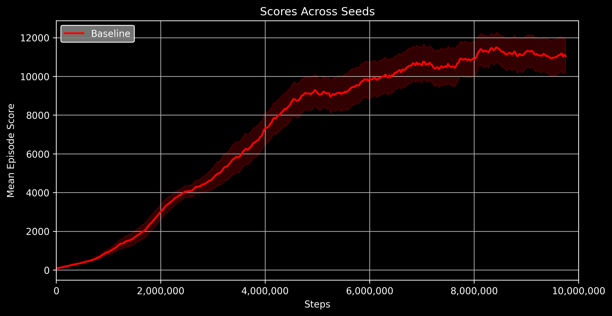
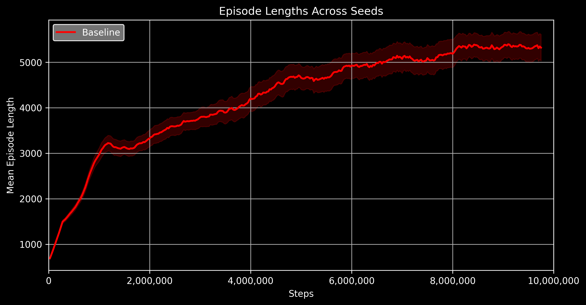

We see a nice learning curve and a stagnated performance at the end. These curves and also watching the agents [play](https://drive.google.com/file/d/1c5087ZbdnKZhk1qxT9oqLs7-px5qm86N/view?usp=drive_link), show that the agents are only able to play the first level of the game.

### Remove Fire action
Since the fire action is equivalent to the no-op action in this game, I thought maybe removing it and having an action space of 5 results in faster convergence. 
For this, we use a custom wrapper `RemoveFireWrapper` which is defined in [custom_wrappers.py](wrapper/custom_wrappers.py) after the Atari Wrapper.
This is defined in [def_fire_remove.yml](experiments/def_fire_removed.yml).
The logs for this experiment are available via this [Google Drive Link](https://drive.google.com/drive/u/2/folders/1pHfLwQ9K7Y4UsSZbjz1qJ8ZMJX3XynXa?hl=de).

We get the following graphs for Gamescore and Episode Length during training evaluation:

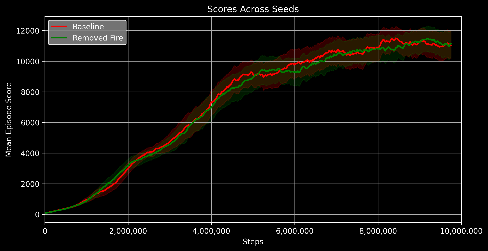
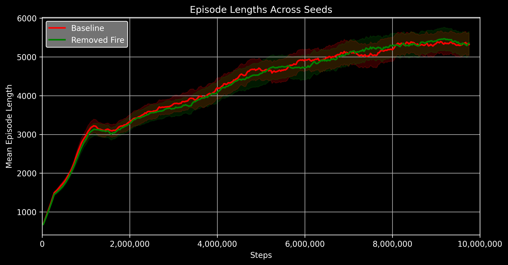

The results show that this didn't really change anything in the performance of the agents. This is not completely surprising, since this was a minimal change.


### Framestack variations
The optimal framestack value in the hyperparameters is stated as 4 and the Baseline was trained on this. I was interested in seeing in which way the variation of
this parameter is affecting the performance and how important the temporal context of the game is. Through the stacking of frames, the algorithm is able to see movement, especially of the enemies.
The framestack parameters I tried are: 1, 2, 4 (Baseline) and 6.
The config files are [def_framestack_1](experiments/def_framestack_1.yml), [def_framestack_2](experiments/def_framestack_2.yml) and [def_framestack_6](experiments/def_framestack_6.yml).
The logs for this experiment are available via these Google Drive Links: [Framestack 1](https://drive.google.com/drive/u/2/folders/1bOO5ElHEyETplnJO29jKyx4Qk5qH6ilz?hl=de),
[Framestack 2](https://drive.google.com/drive/u/2/folders/1HnpqWIH5UbUbT_2LLjIxcks4qzht57sf?hl=de)and [Framestack 6](https://drive.google.com/drive/u/2/folders/1YvWxCCv71ixHL3MlVd1s2uut1ZxK-YUP?hl=de).

The variation of the framestack parameter had an influence on the runtimes, since there are more inputs available. Experiments with Framestack 1, 4, 6 were run simultaneously and therefore, the RAM was used instead of only the GPU. The runtimes are as followed:
* Framestack 1: 6.9 hours per seed.
* Framestack 2: since this one was running alone on the GPU, the runtimes are around 4 hours. In respect to the other runtimes, it should order itself between the runtimes of Framestack 1 and 4.
* Framestack 4 (Baseline): 7.4 hours per seed.
* Framestack 6: 7.9 hours per seed.

We get the following graphs for Gamescore and Episode Length during training evaluation:

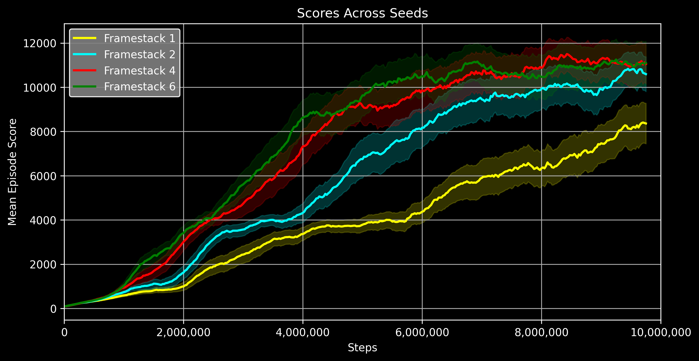
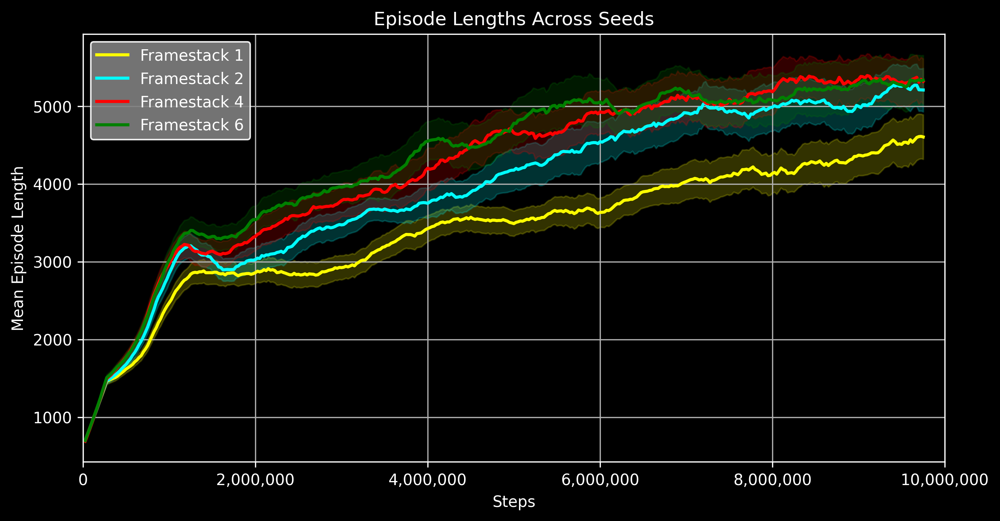

We can see that with more frames stacked, an earlier improved performance is achieved. Also, the curves of stacking 2, 4 and 6 frames are really close together at the end of training and stagnate while we can see that when using just a single frame, the curve is still rising.
Therefore, agents trained without framestacking might have reached similar performance given more training steps.
Overall, this experiment shows that stacking more frames results in faster learning.

### Cropping the score and lives
Since the only relevant information the score and lives gives is the destination cube color, I was interested in seeing if this information is really needed or if it is better to not have that color information and less non-relevant information in the observation.

For this we use a custom wrapper `CropLifeandScoreWrapper` which is defined in [custom_wrappers.py](wrapper/custom_wrappers.py) before the Atari Wrapper.
This is defined in [def_cropped_image.yml](experiments/def_cropped_image.yml).
The logs for this experiment are available via this [Google Drive Link](https://drive.google.com/drive/u/2/folders/1Q2rl7rKby2ZoEjfqvQnsISmw-QOiNZAY?hl=de).

We get the following graphs for Gamescore and Episode Length during training evaluation:

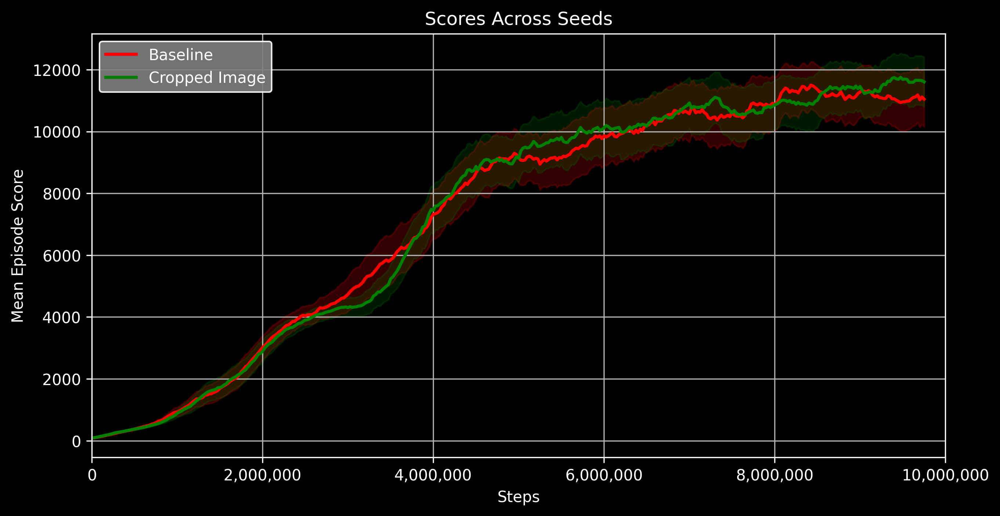
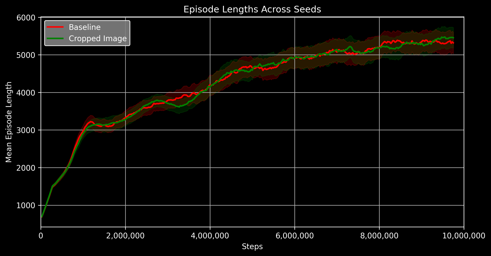

We see that this didn't really have a huge impact on the performance - neither good nor bad -, but we can also see that at the end of training, using the cropped image results in a better score and episode length.
Keep in mind that the agents are only able to play the first level where the destination color doesn't have a huge importance. Maybe at further levels with an intermediate color and decolorization, the information on the destination color would be more of value.


### Raw Rewards
Like already stated, the Atari Wrapper has a parameter `clip_reward`. This parameter is true in default - therefore also in the baseline - and clips the reward into the set {-1, 0, 1}, this being the sign of the reward.
I was interested in seeing why we need this clipping and if a use of the raw Gamescore change would improve the performance, since the clipping doesn't account for the difference in these - setting every positive reward to 1 - and therefore isn't laid out to get the best score.
The runs for the unclipped models had a runtime of 7.1 hours per seed.
The config file is [def_raw_reward.yml](experiments/def_raw_reward.yml).
The logs for this experiment are available via this [Google Drive Link](https://drive.google.com/drive/u/2/folders/1s-PuE75yV1lQWtEv5Afed12WvhZKVTDT?hl=de).

We get the following graphs for Gamescore and Episode Length during training evaluation:

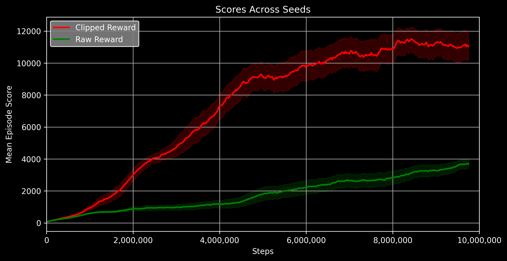
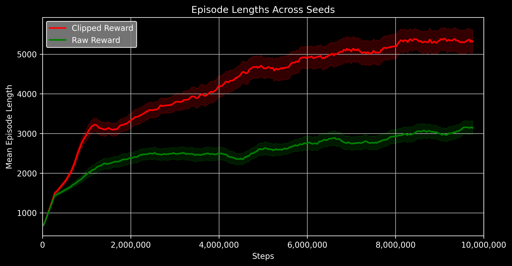

We can see that this approach resulted in a significantly worse performance. But we can also see that at the end of training the curve is still rising, so the learning is maybe just really inefficient and more training steps would help.
After the experiment was done, I thought of why this is happening and came to some reasons, which are:
* The Hyperparameters are tuned to the clipped reward. I would have needed to make a hyperparameter search to get fair results. This wasn't possible since I have a capped time limit and capped computing resources.
* The difference of the reward area results in exploding Q-values, which results in unstable training. The gradients are also highly sensitive to the magnitude of rewards. [[5](https://towardsdatascience.com/learning-how-to-play-atari-games-through-deep-neural-networks/)]

### Reward Min-Max-Scaling
Since just using raw rewards results in a high variance in the gradients and the hyperparameters are also not tuned in such a reward area, I was interested if scaling the reward in a window from 0 to 1 to still differentiate between events - and also be kind of in the reward area the hyperparameters were chosen - would be of help. 
For that, I used Min-Max-Scaling, which is defined as follows:
$r_{\text{scaled}} = \frac{r - r_{\min}}{r_{\max} - r_{\min}}$ with $r_{\min} = 0$ and $r_{\max} = 500$

This results in the following reward changes regarding the original scores:

| Original Score | New Reward |
|---------------:|-----------:|
| 25             | 0.05       |
| 100            | 0.20       |
| 300            | 0.60       |
| 500            | 1.00       |

For this to work, we deactivate the `clip_reward` parameter of the Atari Wrapper 
and use a custom wrapper `RewardMinMaxScalingWrapper` which is defined in [custom_wrappers.py](wrapper/custom_wrappers.py) after it.
This is defined in [def_minmax.yml](experiments/def_minmax.yml).
The logs for this experiment are available via this [Google Drive Link](https://drive.google.com/drive/u/2/folders/1XZZ0RSCDDiKuDJ5qAfO4uqKQGpRFcDH1?hl=de).

We get the following graphs for Gamescore and Episode Length during training evaluation:

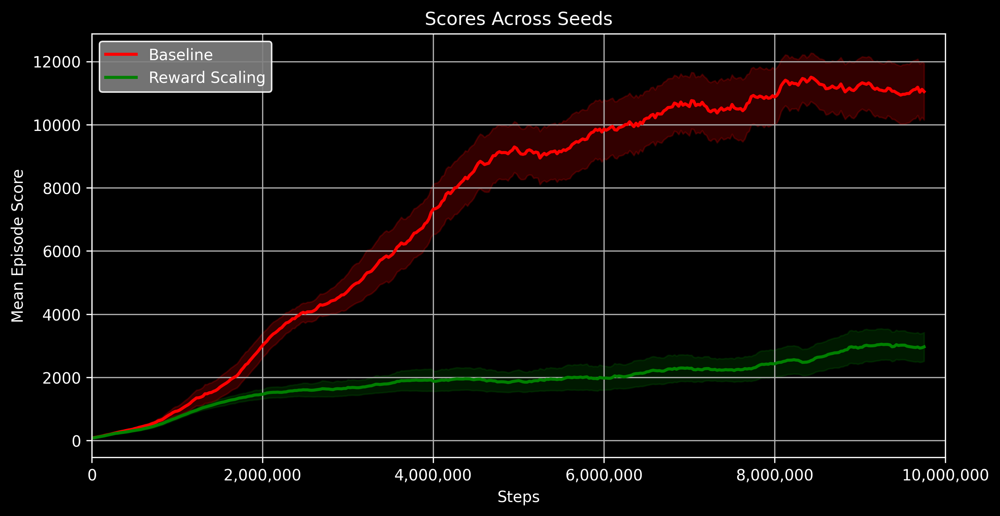
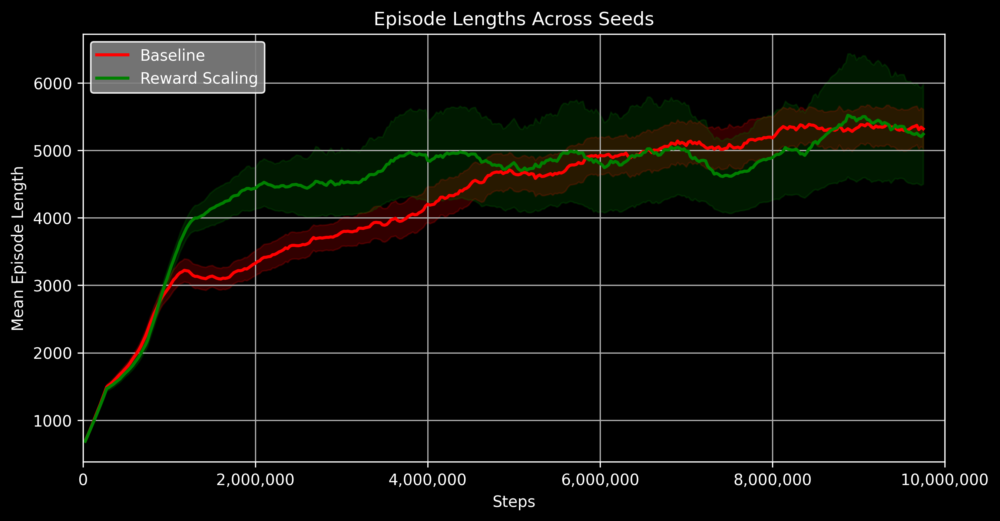

We can see that this also didn't perform well; the score is even worse than using the raw reward. 
Interestingly enough, when looking at the episode length we see that it is even higher than the baseline at the beginning of training and then on the same level as the baseline.
What is also prominent in this graph is that the standard error is really high. We can take a look at the separate runs created by [Plot_OneExp.py](Plot_OneExp.py) and see why this is the case:

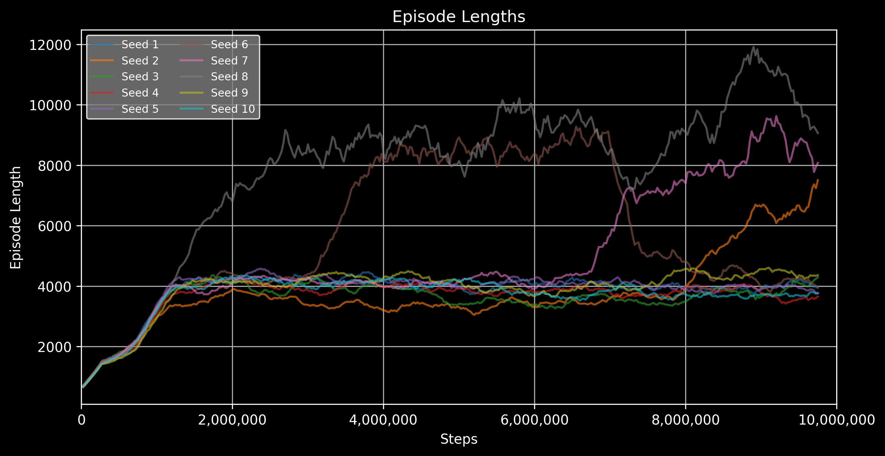

We can see that most of the runs are around the length of 4000. But there are some that  are significantly longer. The performance therefore is very seed dependent.
This wasn't the case for all the other experiments.

When watching the agents [play](https://drive.google.com/file/d/1xLc4r-lFistEWjLzYgNw1aC4uW6jMVPn/view?usp=drive_link), one can see exactly why the episodes are as long as the baselines. The agents focus on getting Coily off the platform since this gets them the best reward. They stand around until Coily comes around and then try to lure him off by jumping on the disks. Also, after the disks are gone, the agents remain in round 1, not knowing what to do - sometimes walking off the pyramid or going in contact with Coily. This, interestingly enough, wasn't the case in the experiment using the raw reward.
Therefore, one could say that in some way this experiment shows - a little bit better than the use of raw rewards -, what one could suspect will happen when using the rewards in relation to the Gamescore change: the agents learned that luring Coily off will get them the best reward. Therefore repeating this behaviour and not learning that getting to the end of the round will get them even more cumulative rewards.
This could work as a strategy if there were unlimited disks available which there aren't.

### Round Completion Focus
Since the agents are only able to play the first level with its 4 rounds, I wanted to encourage them to play this level as fast as possible to hopefully get more experience of the second level.
I thought of two approaches for this: 
* Penalizing the agents for every step, so that they learn to not take useless steps.
* Better Rewards for the coloring into the destination color and round completion.

#### Penalty for needed steps
The penalty for each step is set at $-0.1$
For this, we use a custom wrapper `StepPenaltyWrapper` which is defined in [custom_wrappers.py](wrapper/custom_wrappers.py) after the Atari Wrapper.
This is defined in [def_step_penalty.yml](experiments/def_step_penalty.yml).
The logs for this experiment are available via this [Google Drive Link](https://drive.google.com/drive/u/2/folders/1Ws0r-4sRHZaib1ebEXwW1H7x9KvwOUNs?hl=de).

We get the following graphs for Gamescore and Episode Length during training evaluation:


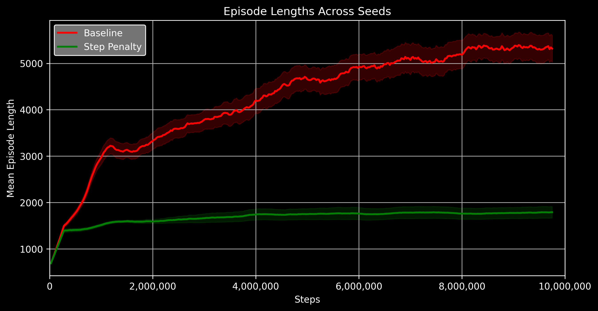

We can see that this results in a significantly lower performance - even worse than the experiments from before.
When watching the agents [play](https://drive.google.com/file/d/1v-jhu4SiRPYfqe17Tr_UgS2nsC9xlCe3/view?usp=drive_link), one can see that the agents can't even complete the first level and walk off the platform.

In hindsight, the penalty magnitude was likely way too high for this to even work well, since only a reward of 1 can be received.
The agents only learn to fall off the pyramid since this will get them the smaller cumulative punishment.

Also, looking at the separate runs we see the following:

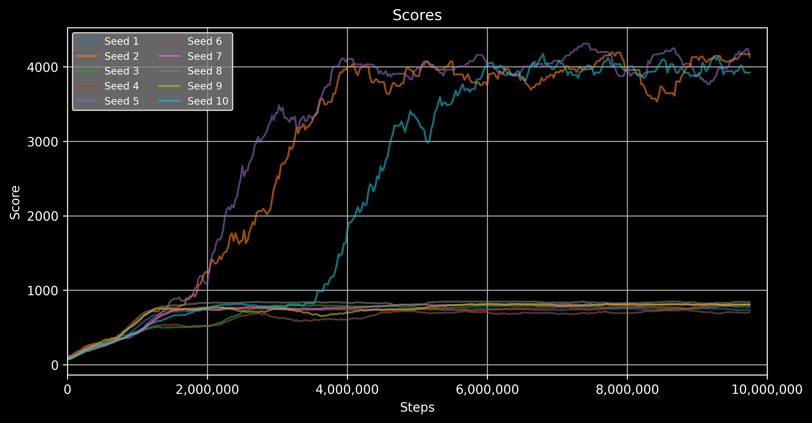
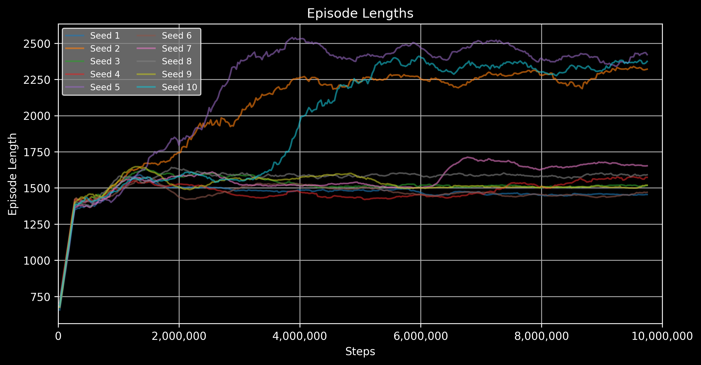

We can see that 3 of the 10 runs actually learn to reach a score of 4000. These runs were lucky to make some good experiences.
This experiment, together with the Min-Max Scaling one, are the only ones where the seeds have such a difference.

#### Better Rewards for coloring and round completion
To reward coloring and round completion, one first needs to identify these events.
For coloring, this is simply done by looking at the raw reward and identifying if it is $25$.
For round completion, it is a little bit trickier since the 3100 points are shared between 31 frames, each having 100 points.
We can't just look if the reward is $100$, since collecting the green ball also gives the same reward.
I came up with a suboptimal solution which is saving the last received reward, and then we can look if the last reward was $100$ and the current reward is $100$
to identify a round completion. With this solution, the first reward of the round completion would not be changed.
Both coloring and each frame from round completion get a reward of 2, everything else remains like if it was clipped from the Atari Wrapper.

For this to work, we deactivate the `clip_reward` parameter of the Atari Wrapper 
and use a custom wrapper `RewardCompletionAndColoringWrapper` which is defined in [custom_wrappers.py](wrapper/custom_wrappers.py) after it.
This is defined in [def_round_completion_focus.yml](experiments/def_round_completion_focus.yml).
The logs for this experiment are available via this [Google Drive Link](https://drive.google.com/drive/u/2/folders/16ypPHKZlcIK64b8pwkaICo3JiCimTyoE?hl=de).


We get the following graphs for Gamescore and Episode Length during training evaluation:


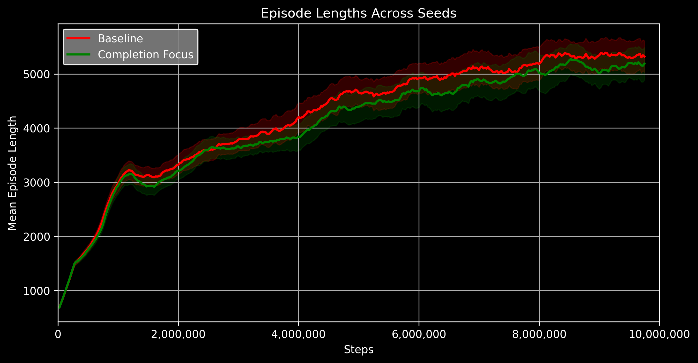

We see that the performance of these agents is slightly worse than the baseline ones.
Maybe a hyperparameter search could help since the reward area was changed again.

### Overview of the experiments
For a better overview of the experiments carried out, I want to give two comparison graphs of the measurements of the Game Score and the Episode Length.
Each line corresponds to one of the experiments.

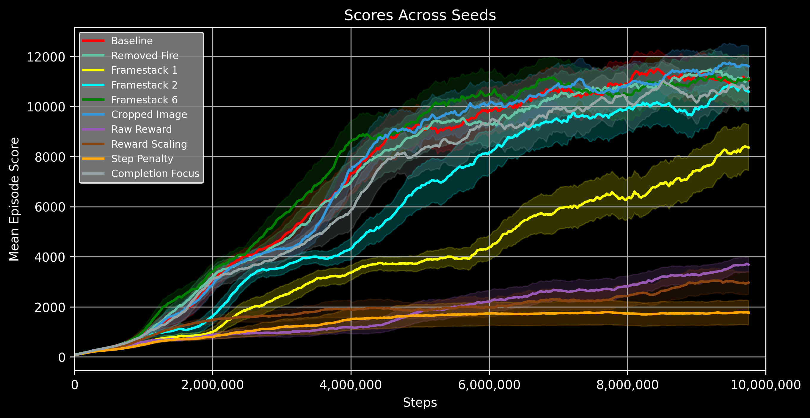
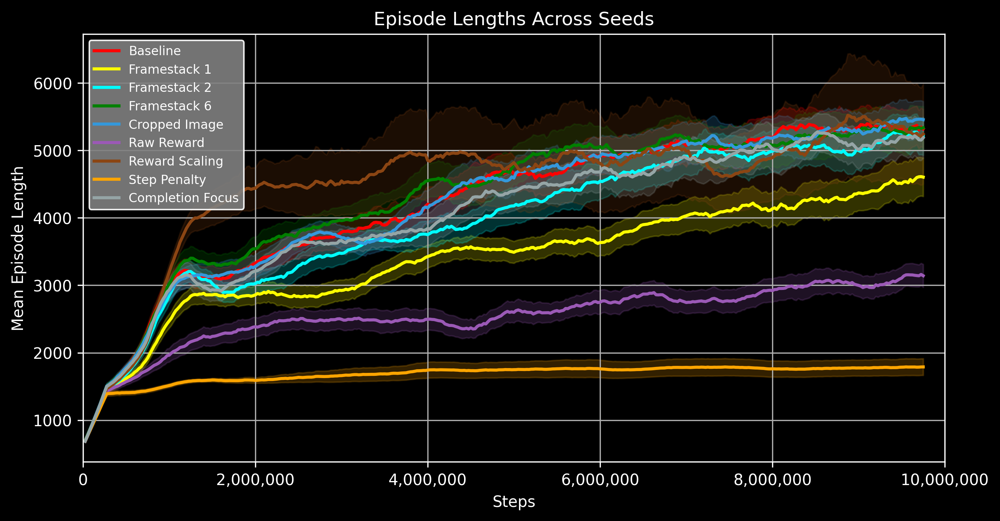

We can see that the experiment with the Step Penalty achieved the worst performance in both scores. Also, the agents using Min-Max Scaling and the raw reward did perform awfully in the score metric, 
but in the episode length metric, the Min-Max-Scaling reached the same episode lengths as the top experiments because they stayed long in round 1 to lure Coily off.
Using a single frame performed okay. Then we have a cluster of experiments that all reach a similar end score in training. The worst of these being stacking 2 frames, then the Completion Focus (this being the better rewards for coloring and round completion).
A really similar performance was achieved by the Baseline, the removal of the fire action, the stacking of 6 frames and the cropped image experiments. Here the Framestack 6 agents learn the fastest, but they also end up with the same metric scores as the baseline.
The use of the cropped image seems to have achieved the best performance at the end of training.

### Performance of the final agents
To further evaluate the agents we get at the end of each experiment and seed combination,
each agent was taken and evaluated for 30 seeds, each evaluating 1 episode - the starting seed being 42. 
The script for this can be found in [evaluate_score.py](evaluate_score.py).
This script produces a Dataframe `evaluation_results.csv` which consists of the experiment name, seed, mean score, mean episode length and the standard deviation for both of them.
This Dataframe is loaded in [aggregate_eval.py](aggregate_eval.py) to get the mean of means and therefore a final evaluation score for an experiment,
which consists of 300 evaluation episodes. The scores are then saved in `evaluation_overall.csv`. 
We then get the following meaningful table:

| Metric                                 | Baseline         | Removed Fire     | Framestack 1    | Framestack 2     | Framestack 6     | Cropped Image    | Raw Reward      | Reward Scaling  | Step Penalty    | Completion Focus |
|----------------------------------------|------------------|------------------|-----------------|------------------|------------------|------------------|-----------------|-----------------|-----------------|------------------|
| $\varnothing$ Score $\pm$ Std          | 12957 $\pm$ 3373 | 12270 $\pm$ 2717 | 9059 $\pm$ 3063 | 12723 $\pm$ 2784 | 13006 $\pm$ 1583 | 13150 $\pm$ 2712 | 3792 $\pm$ 1085 | 4873 $\pm$ 2745 | 1859 $\pm$ 1722 | 11934 $\pm$ 2201 |
| $\varnothing$ Episode Length $\pm$ Std | 6125 $\pm$ 1151  | 5888 $\pm$ 1114  | 4639 $\pm$ 701  | 6125 $\pm$ 840   | 6087 $\pm$ 784   | 6129 $\pm$ 917   | 3232 $\pm$ 651  | 8387 $\pm$ 6331 | 1775 $\pm$ 462  | 5645 $\pm$ 918   |

Shown as a bar chart we get the following graphic produced by [Plot_Eval.py](Plot_Eval.py):

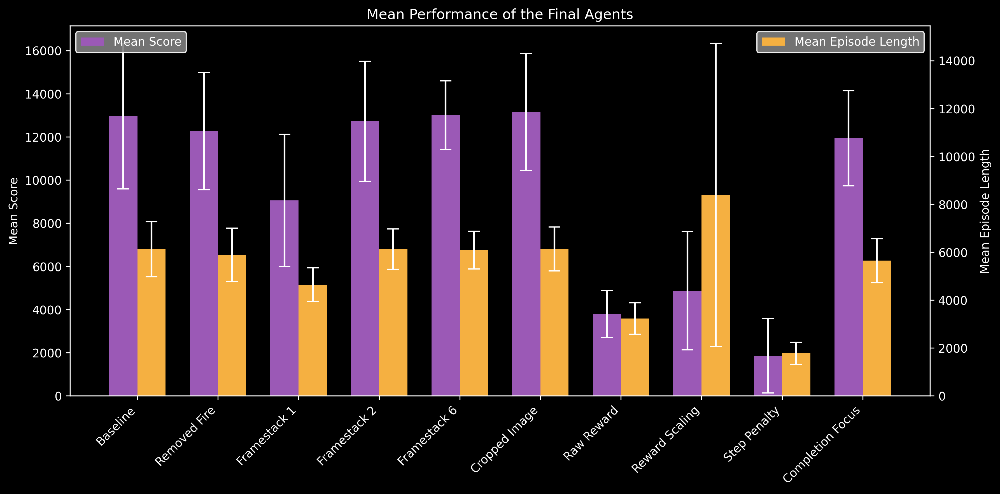

For the score, we get the best means when using a cropped image, followed by stacking 6 frames and then the baseline.
If we look at the episode length, Min-Max Scaling has the highest mean, followed by Cropped Image and Framestack 2.
Since here, the score is more meaningful than the episode length, we can identify the Cropped Image experiment as the best one.

### The single best final agent
Though the Cropped Image experiment got the best mean agents, the best single final agent is from the Baseline with Seed 1.
This agent did get a mean score of 16.135 in the evaluation. It can be seen playing [here](https://drive.google.com/file/d/1c5087ZbdnKZhk1qxT9oqLs7-px5qm86N/view?usp=drive_link).

### Overview, Takeaways and Possible Future Work

Given the carried out experiments, we can make some statements given the created experiment foundation:
- Stacking more frames enables faster convergence to good results.
- Cropping the observation and therefore deleting maybe valuable information on the destination color did not have a huge impact, neither negative nor positive. It would be interesting to know if an agent that can also play the second level, would need this information. Still, the evaluation results show that the agents resulting of these experiments are in the mean the best. 
- Playing with the reward structure is very risky and often results in a much worse performance when changing too much. 
  - It is very difficult to get to concrete conclusions since no hyperparameter search was possible and a direct comparison to the agents trained on the already tuned hyperparameters is not fair.
- Sudden changes in coloring mechanics between levels are critical. The agents do not know how to act in such a new scenario and fail. Sadly, attempts to focus on round completion didn't help here because the agents resulting from these weren't quicker in learning than the baseline and therefore could not get more experience at the new level. 
  - One idea to be able to get an agent to play the second level would be to train a separate agent.
